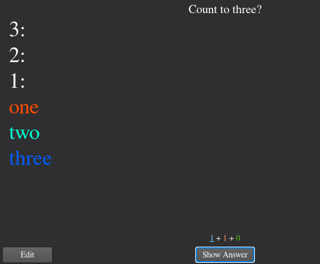
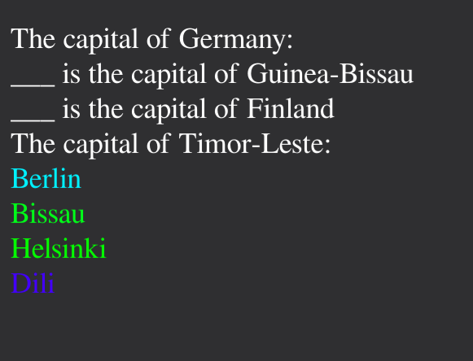
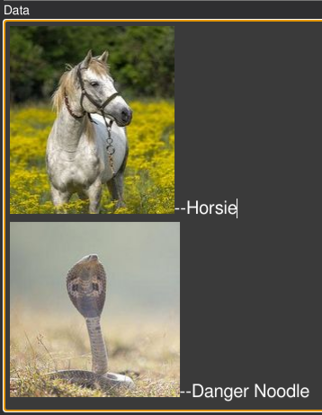
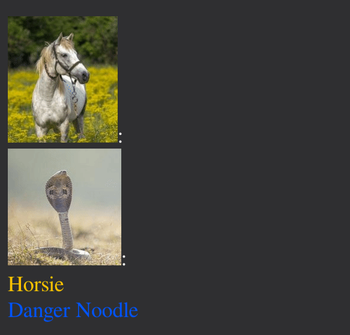

# Confuse Groups

ConfuseGroups is a card type intended to practice terms that the user often confuses for each other.

This is achieved by using Javascript to randomize the order of question-answer pairs, prompting the user to match them up.

Click on any of the answers (right side of the data) to reveal which question it belongs to.

## Example

Type the following into the "Data" field:

```
1-one
2-two
3-three
```

It should look like this:


And give you this card:




## Open-Cloze

ConfuseGroups now support open-cloze type questions. If you prefer that the correct answer appears inside the question (as opposed to at the end of the line), mark its place with three underscores `___`. 

The following Data:

```txt
The capital of Germany-Berlin
___ is the capital of Finland-Helsinki
The capital of Timor-Leste--Dili
___ is the capital of Guinea-Bissau--Bissau
```

Would result in this card:



## Pictures

You can paste pictures directly into Anki's editor and they will work.

Input this:



To get this card:



## Dashes in Text?

Dashes `-` are used to separate the question and answer part. If you want to have dashes inside your text, then you need to use two dashes `--` as a separator instead.

The above example shows this.

*Imported files and formatting (such as pictures) might contain hidden dashes. Use `--` if you're using images.*
