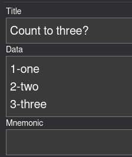

# Confuse Groups

ConfuseGroups is a card type intended to practice terms that the user often confuses for each other.

This is achieved by using Javascript to randomize the order of question-answer pairs, prompting the user to match them up.

Click on any of the answers (right side of the data) to reveal which question it belongs to.

## How to Get

### Importable Deck

1. Go to the [Releases](https://github.com/MNandor/anki-cards/releases) page and find the newest version of ConfuseGroups.
2. Save the `.apkg` file
3. In Anki, File/Import and select the file

### Manual

(instructions are for Desktop Anki - but the card type works on AnkiDroid, too)

1. Create a new Note type: Tools / Manage Note Types / Add
2. Give it the required fields: Tools / Manage Note Types / (Select the type you just created) / Fields
3. It needs a `Title`, `Data`, and a `Mnemonic` field. You can also add any additional fields you might want to use.
4. Click on Cards... and edit it as follows
  5. Copy `card1_front.html` into Front Template
  6. Copy `card1_back.html` into Back Template
  7. Copy `card1.css` into Styling
8. You're done! You can create cards with this template now!

## Example

Type the following into the "Data" field:

```
1-one
2-two
3-three
```

It should look like this:



And give you this card:


## Open-Cloze

ConfuseGroups now support open-cloze type questions. If you prefer that the correct answer appears inside the question (as opposed to at the end of the line), mark its place with three underscores `___`. 

The following Data:

```txt
The capital of Germany-Berlin
___ is the capital of Finland-Helsinki
The capital of Timor-Leste--Dili
___ is the capital of Guinea-Bissau--Bissau
```

Would result in this card:


## Pictures

You can paste pictures directly into Anki's editor and they will work.

Input this:


To get this card:


## Dashes in Text?

Dashes `-` are used to separate the question and answer part. If you want to have dashes inside your text, then you need to use two dashes `--` as a separator instead.

The above example shows this.

*Imported files and formatting (such as pictures) might contain hidden dashes. Use `--` if you're using images.*
